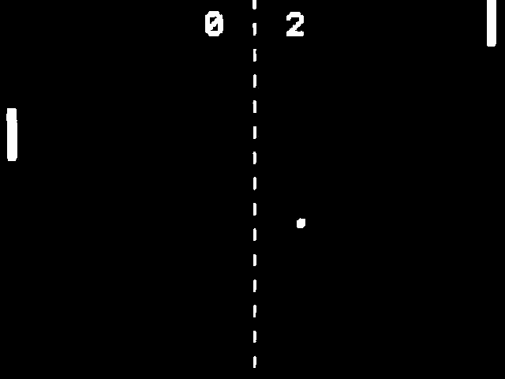
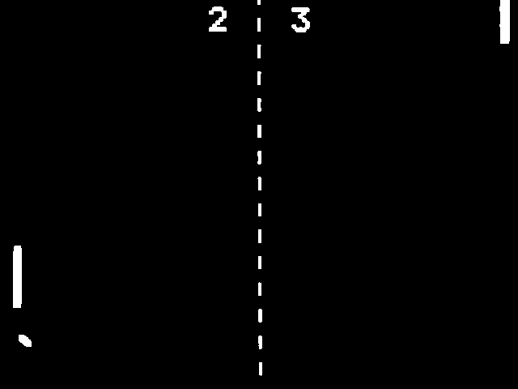
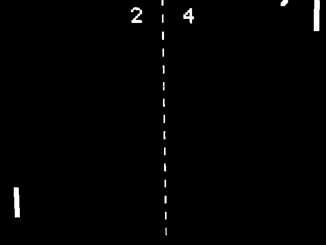

# VGA Pong on ZedBoard

A two-player Pong implementation driven entirely in SystemVerilog, rendered
over VGA from the ZedBoard's onboard DAC. No frame buffer, no soft
processor involvement — every pixel is computed live, once per scanline,
by combinational logic reading the current game state.



| Score 2-3 | Score 2-4 |
|---|---|
|  |  |

## Why this project

Most "VGA on FPGA" tutorials stop at drawing a static test pattern. This
project pushes one step further: a real-time interactive game where the
video timing generator, game state, and pixel renderer are cleanly
separated into their own modules — which is closer to how actual video
pipelines are architected than a single monolithic always_block.

## Architecture

```
clk100mhz ──▶ clk_div ──▶ pixel_tick ──▶ vga_timing ──▶ hcount, vcount, frame_tick
                                                              │
buttons/switches ──▶ debounce ──▶ game_logic ◀───────────────┘
                                       │
                                       ▼
                                  pixel_gen ──▶ vga_r/g/b, vga_hs, vga_vs
```

- **`clk_div`** — derives a ~25MHz pixel *clock enable* from the 100MHz
  system clock. Deliberately not a real derived clock net: everything
  stays in one clock domain, which avoids CDC bugs entirely.
- **`vga_timing`** — the standard 640×480@60Hz counter/sync generator,
  plus a `frame_tick` pulse once per frame that the game logic hangs off.
- **`debounce`** — cleans up mechanical bounce on the pushbuttons/switches.
- **`game_logic`** — the only stateful "game" module: paddle positions,
  ball position/velocity, collision detection, and score. Updates exactly
  once per frame, so gameplay speed is locked to 60Hz regardless of
  anything downstream.
- **`digit_rom`** — a tiny 5×7 bitmap font ROM used for the scoreboard.
- **`pixel_gen`** — pure combinational logic. Given `(hcount, vcount)` and
  the current game state, decides what color the current pixel is. No
  state of its own.

## Controls

| Player | Up | Down |
|---|---|---|
| Player 1 (left paddle) | `BTNU` | `BTND` |
| Player 2 (right paddle) | `SW0` | `SW1` |

`BTNC` resets the game (score to 0-0, ball re-served from center).

## Hardware

- ZedBoard (Zynq-7000)
- VGA cable, ZedBoard's onboard VGA connector → monitor
- No additional hardware needed — the ZedBoard's resistor-ladder DAC
  drives the VGA port directly from the pins in `constraints/vga_pong.xdc`

## Building

1. Create a new Vivado project targeting the ZedBoard (`xc7z020clg484-1`).
2. Add all files under `rtl/` as design sources, `top.sv` as the top module.
3. Add `constraints/vga_pong.xdc` as the constraints file.
4. Generate bitstream, program the board over JTAG.

## Simulation

A self-checking testbench for the timing generator lives in `sim/`:

```
xvlog rtl/vga_timing.sv sim/vga_timing_tb.sv
xelab vga_timing_tb
xsim vga_timing_tb -runall
```

It checks that `hcount`/`vcount` wrap at the correct totals and that
`frame_tick` fires once per frame — catches most off-by-one timing bugs
before you ever touch hardware.

## Known limitations / stretch goals

- Ball collision uses simple AABB overlap — no angle change based on
  where the ball hits the paddle (real Pong varies the bounce angle).
- Score caps at 9 per player (single digit) — could extend to two digits.
- Resolution and refresh rate are hardcoded; a mode-select register
  driving a real MMCM would allow runtime resolution switching.
- No audio (ZedBoard has an audio codec — a simple "beep" on paddle hit
  would be a fun addition).

## License

MIT
